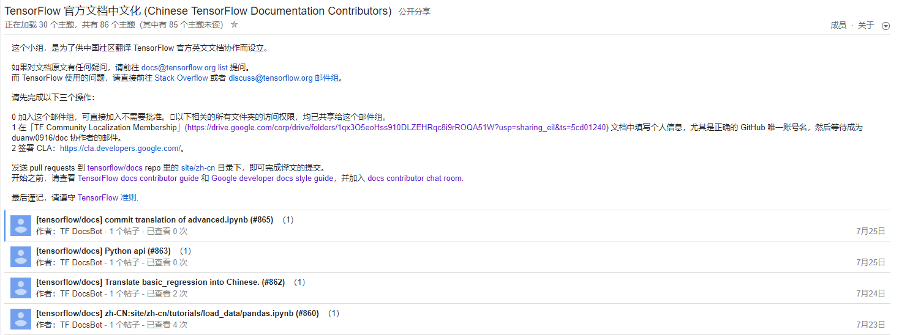
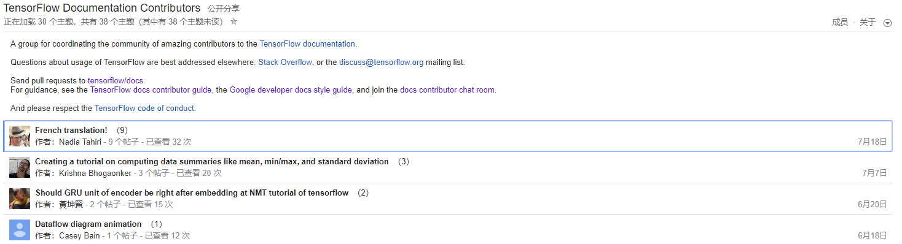
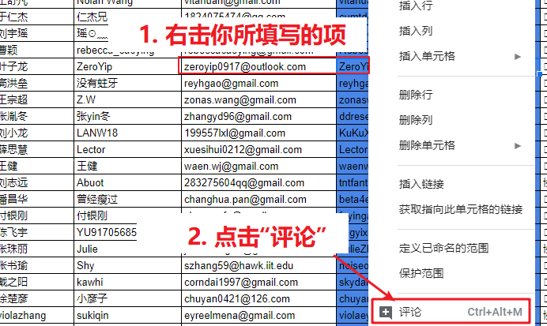
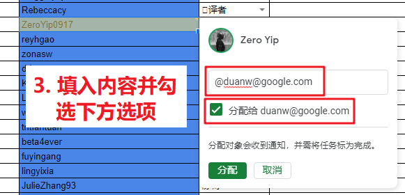

# 
**TensorFlow 官方文档中文化协助手册**

---

[TOC]

## 项目介绍

- **项目名称**：TensorFlow 官方英文文档社区汉化
- **发起组织**：Google Brain 技术文档撰稿团队
- **成立时间**：2019 年 03 月
- **成立初衷**：
    为加速 TensorFlow 于中国地区落地速度，同时促使更多非英语母语开发者可无障碍阅读官方文档而设立
- **成立目的**：
    面向所有人招募有意加入 TensorFlow 官方英文文档汉化工作1的人员

> [1] 社区翻译基于什么运作？  
[GitHub](https://github.com/)  
[TensorFlow/docs](https://github.com/tensorflow/docs)  
[TensorFlow China Community Localization Project（任务领取）](https://github.com/duanw0916/docs/projects/1)  
[TensorFlow 官方文档中文化](https://groups.google.com/a/tensorflow.org/forum/#!forum/docs-zh-cn)   
[全球的 TensorFlow Documentation Contributors](https://groups.google.com/a/tensorflow.org/forum/#!forum/docs)  
[Google Hangouts Meet](https://meet.google.com/yri-ujnb-qxa)  
TF Community Localization（微信群）

## 准备工作

### 前期准备

(1) 保证网络通畅（需要科学上网）

(2) 注册（或拥有）一个 Google 账号和一个 GitHub 账号

(3) 加入 [TensorFlow 官方文档中文化邮件组](https://groups.google.com/a/tensorflow.org/forum/#!forum/docs-zh-cn) 2

   

   加入[全球的 TensorFlow Documentation Contributors（可选）](https://groups.google.com/a/tensorflow.org/forum/#!forum/docs)

   

(4) 在 [TF Community Localization Membership 中的 Excel 文档中](https://docs.google.com/spreadsheets/d/1_tqQrrfPJAnX1-obuIZYPX_fZPmd3_EytgaRF3qz_qs/edit?usp=drive_web&ouid=102279685002386439932)填写相关信息，正确填写完毕，等候 duanw0916 发送邀请确认（将会发送邀请通知至你所填写的 GitHub 注册所用的邮箱中）3 4

  

  

(5) 签署 [CLA](https://cla.developers.google.com/)（选择签署个人 CLA）

   

(6) 加入微信工作群（负责人微信：BinaryHB，添加备注：TensorFlow）

> [2] 无需验证，直接加入，且相关文件已共享 
>  
> [3] 信息填写完毕，需要评论该条信息，具体操作如下：
>
>  
>
>  
>
> [4] 验证是否成为项目协作者可至 [Project](https://github.com/duanw0916/docs/projects/1) 进行对于 Card 的操作，若可顺利操作，则表明已经加入。

### 文档阅读

[1] [TensorFlow 官方文档汉化协助教程](https://drive.google.com/open?id=1En_UACoKLLnktj9pD3O7vYtD1iOmBKYBbNaJsM0ra8o)

[2] [格式标准、术语比对、审校重点](https://drive.google.com/open?id=1v7kwEhvtbbI4S4gulxLJDDN78gv0ZlDJ0cN92BUPrm0)

[3] [Google Developer Documentation Style Guide](https://developers.google.com/style/highlights)

[4] [TF 官方文档样式指导](https://www.tensorflow.org/community/contribute/docs_style)

[5] [中文文案排班指北](https://github.com/sparanoid/chinese-copywriting-guidelines/blob/master/README.zh-CN.md)

[6] [TF 机器学习术语表](https://developers.google.com/machine-learning/glossary/)

## 工具介绍

### 交流工具

- Email
- WeChat
- Google Group
- Google Hangouts

### 协作工具

- Github、Github Project

## 操作手册

### 文案排版指南

### **中文**

**中文与英文之间需要增加空格**

正确：
> 在 Google Doc 中，注意使用正确的文案排版。

错误：
> 在Google Doc中，注意使用正确的文案排版。

**中文和数字之间需要增加空格**

正确：
> 今天是翻译社区成立第 100 天。

错误：
> 今天是翻译社区成立第 100天。  
> 今天是翻译社区成立第100天。

**关于「首行缩进」**

不建议使用首行缩进

正确：
> 英文文档汉化过程中不建议使用首行缩进。

错误：
> &nbsp;&nbsp;&nbsp;&nbsp;英文文档汉化过程中不建议使用首行缩进。

**关于「全角标点」**

中文文档建议完全使用全角标点

正确：
> 果然，他是一名中国人！  

错误：
> 果然,他是一名中国人!（使用了半角标点）  
> 果然,他是一名中国人！（未完全使用全角标点）

不重复使用标点符号

正确：
> 中国男足竟然战胜了德国队！  

错误：
> 中国男足竟然战胜了德国队！！  
> 中国男足竟然战胜了德国队！！！！  
> 中国男足怎么可能战胜德国队？？！！  
> 中国男足怎么可能战胜德国队？？！！？？！！  

全角标点与其他字符之间不添加空格

正确：
> 刚刚买了一部 iPhone，好开心！

错误：
> 刚刚买了一部 iPhone ，好开心！
> 刚刚买了一部iPhone，好开心！

行首行末禁则

正确：
> 排版时需要注意的是，  
> 点号（顿号、逗号、句号等）、结束引号、结束括号等不可出现于行首，  
> 同时开始引号、开始括号、开始双书名号等不可出现于行末，  
> 这符合了「中文文案排版规范」。

错误：
> 排版时需要注意的是  
> ，  点号（顿号、逗号、句号等）、结束引号、    
> 结束括号等不可出现于行首，同时开始引号、  
> 开始括号、开始双书名号等不可出现于行末，这符合了「  
> 中文文案排版规范」。

省略号（删节号）占用 4 个字节

正确：
> 中国设计还有太长的路要走......

错误：
> 中国设计还有太长的路要走...  
> 中国设计还有太长的路要走..

破折号占用 2 个字节

正确：
> 这是四大名著之一——《西游记》

错误：
> 这是四大名著之一—《西游记》（仅占用 1 个字节）  
> 这是四大名著之--《西游记》（使用了半角的连字符）  
> 这是四大名著之一__《西游记》  

**使用直角引号**

建议使用直角引号（替换弯角引号）

正确：
> 你竟然喜欢「苹果手表」？

引号中再次使用引号以双直角引号替代

正确：
> 我问道，「你竟然喜欢『苹果手表』」？

错误：
> 我问道，「你竟然喜欢「苹果手表」」？

当引号表示讽刺、暗示、反语等含义时，使用弯引号

正确：
> 说真的，我也很“喜欢”「苹果手表」呢！

错误：
> 说真的，我也很"喜欢"「苹果手表」呢！（使用了半角的弯引号）

**关于超链接**

**建议在超链接的前后添加一个空格**

示例：
> 请 [提交一个issue]() 并分配给相关同事。
> 访问网站最新动态请 [点击这里]() 进行订阅！

### **英文**

**首字母大写**

正确：
> Just do it!

错误：
> just do it!

**组合单词或句子中的连词、冠词以及介词短语无需大写**

正确：
> People's Republic of China  
> A Egg in the Box.  
> The dog in the House.

错误：
> People's Republic Of China  
> A Egg In The Box.  
> the dog in the House.（句首单词大写）

**标题可全字母大写**

正确：
> JUST DO IT!  

**遵循专业名词的大小写，且不可使用非官方缩写**

正确：
> JavaScript  
> HTML 5  
> iPhone 6s

错误：
> javascript  
> H5 或 h5  

**点号（如逗号、句号）后需要添加一个空格**

正确：
> Hello! Our World!  
> This is an example. This is another example.

错误：
> Hello!Our World!  
> This is an example.This is another example.

**括号、引号的前后需要添加一个空格，其中间内容无需添加空格**

示例：
> 5.04 ouences (143 grams)  
> Did you say "I love you"?

**“at”标志（除电子邮件）、版权标识、项目符号等后需要添加一个空格**

示例：
> @ Hindy, © Hindy   
> hindy@buzhihu.com

**连字符（-）前后无需添加空格**

示例：
> Multi‑Touch   
> Jean-Jacques Rousseau

**全角连接号（—）前后需要添加一个空格**

示例：
> So not only will you see what a press can do — you’ll feel it. 

**关于单词间断**

囿于页面显示宽度而导致单词间断，建议将完整单词直接拼接至下一行的首部而不采用传统的“-”连接符

示例：
> If you are right, let's go  
> and get it!

对比示例：
> If you are right, let's go an-  
> d get it!

**遇到完整的英文整句、特殊名词时，其内容使用半角标点**

正确：
> 贾伯斯那句话是怎么说的？「Stay hungry, stay foolish.」  
> 推荐你阅读《Hackers & Painters: Big Ideas from the Computer Age》，非常的有趣。

错误：
> 贾伯斯那句话是怎么说的？「Stay hungry，stay foolish。」  
> 推荐你阅读《Hackers＆Painters：Big Ideas from the Computer Age》，非常的有趣。

**关于斜体**

在英文中，斜体常用于表示人名、地名或书名等（在英文里没有书名号），同时可用于强调某个单词或句子。若英文原文出现斜体，那么在汉化过程中，可同样使用斜体进行强调，或将其转化为对应符号进行替代。

### **数字**

**数字使用半角字符**

在设计稿、宣传海报中若出现极少量数字的情形时，为方便文字对齐，可使用全角字符形式的数字。

正确：
> 这个蛋糕只卖 1000 元。

错误：
> 这个蛋糕只卖 １０００ 元。

**数字与单位之间需要添加一个空格**

度的标志、百分号等符号前无需添加空格，  
货币标志、表正负符号等符号后无需添加空格。

示例：
> 70°，100%  
> ￥10，-15  
> 10 Gbps  
> SSD 的存储容量为 20 TB。  

### **序号**

**对于操作步骤，建议使用“(*)”（半角括号）的形式标注，并在其后添加一个空格**  
**在第 1 个至第 n-1 个操作步骤的末尾可选添加“；”符号，在第 n 个操作步骤的末尾可选添加“。”符号**

示例：
> (1) 操作步骤（；）  
> (2) 操作步骤（；）  
> (3) 操作步骤（；）  
> (4) 操作步骤（。）

**对于注释或引用，建议使用“[*]”（半角）的形式标注，并在其后添加一个空格**  

示例：
> [1] 注释  
> [2] 注释  
> [3] 注释  
> [4] 注释

> [1] 引用  
> [2] 引用  
> [3] 引用  
> [4] 引用

### **空格**

为避免争端，空格建议使用空格键（Spacebar键）进行输出，而不使用制表键（Tabulator键）。

> 本「文案排版指南」参考内容如下：  
> [1] [中文文案排版指北](https://github.com/sparanoid/chinese-copywriting-guidelines/blob/master/README.zh-CN.md)  
> [2] [写给大家看的中文排版指南，设计师、文案、编辑一定要看看](https://www.digitaling.com/articles/23555.html)  
> [3] [TensorFlow documentation style guide](https://www.tensorflow.org/community/contribute/docs_style)  
> [4] [Google Developer Documentation Style Guide
](https://developers.google.com/style/highlights)

### 翻译

文档翻译首先需要将 TensorFlow 的[文档仓库](https://github.com/tensorflow/docs) fork 到个人 Github 账号下。

这个步骤完成后，将个人账号下的文档仓库下载到本地：

*注意定期和 TensorFlow 的文档仓库同步，避免后面发起 Pull Request 时有冲突。可参考[教程](https://blog.csdn.net/qianqianstd/article/details/80148341)。*

下面是每次进行文档翻译时的操作步骤:
1. 领取任务
    
    前往[Project](https://github.com/duanw0916/docs/projects/1)，领取任务(*需要在加入操作步骤中第 4 步成功成为协作者*)，按照下图进行任务领取：
    

1. 翻译文档
    
    领取完任务后，按照上面任务中 attention 的提交路径创建文件，并且进行文档翻译。翻译时，请遵守 Google 文档编写的相关规范。

1. 推送到个人仓库
    
    翻译完毕后，将你的文档推送到你的Github个人仓库中。

1. 发起 Pull Request
    
    进入到你的Github个人仓库页面，点击 New pull request 和 Create pull request，发起 Pull Request。其中 Title 按照：zh-CN：xxxxx 格式填写。

    
    
 
    成功发起 Pull Request 后，等待 Reviewer 进行审校。
    
    

1. 等待审校意见和修改
    
    接下来，回到 [Project])https://github.com/duanw0916/docs/projects/1) 页面，找到你领取的任务，将板子拖动到 Reviewing 栏，等待 Reviewer 领取任务，对你的翻译进行审校。

    

    之后，关注你发起的 Pull Request，Reviewer 会对你的翻译提出修改意见。根据修改意见，进行修改后，再次推送到你的Github 仓库(你的修改会实时反映到你的 Pull Request 中)。
1. 翻译结束
    
    当审校通过后，Reviewer 会给你的 Pull Request 打上 lgtm(look good to me) 的标签。这时，等待 TensorFlow 官方人员 merge 你的 pull request。当你收到如下消息时，这个翻译任务就完成了。

    

### 审校

### 协调

## FAQ

### 翻译

- Q: 有格式要求吗？
  > 有，请参看[指南](https://docs.google.com/document/d/1v7kwEhvtbbI4S4gulxLJDDN78gv0ZlDJ0cN92BUPrm0/edit)

- Q: 已翻译完了一篇文档，但是文档没有merge到主分支，可以认领新的翻译任务吗？
  > 每次提交 pull request 时，该分支下应该只对应一个翻译文件，因此，在一篇已翻译完的文档对应的 pull request 还没有 merge 到主分支而想认领新的翻译任务时，可以在自己 fork 的仓库下根据最新的 master 分支建立一个新的分支，在新的分支上进行新的翻译任务。具体方法参见[指南](https://www.tensorflow.org/community/contribute/docs)。

- Q: 如何处理 CLA 标签从 yes 变成 no 的情况？
  > 如果您一直是用 ssh 校验提交，可能不会遇到此问题，但在一些情况下，例如将审校的建议直接在网页端提交后，可能会出现 cla:yes 变成 cla:no 的情况。此时最可能的原因就是 googlebot 的说明中提到的，提交的邮箱和签署 CLA 的邮箱不符。此时有两种解决方案：一是等待人工审核，如下图；二是如果您的 GitHub 个人设置的 Email 选项中并没有选中 Keep my email addresses private，即没有用 @users.noreply.github.com 作为您的网页端提交邮箱，则可以将您设置的 Primary email address 加入到您签署的 CLA 中，然后添加一条 “@googlebot rescan” 的评论，让 googlebot 重新检测 CLA 的签署情况。
  
  在[文档](https://opensource.google.com/docs/cla/#wrong-email)中给出了查看GitHub的某个 pull request 的提交人所用到的邮箱地址的方法，即在地址栏的地址后加上.patch，如https://github.com/grpc/grpc/pull/12.patch。

### 审校

### 协调

## 感言及展望

TensorFlow Community Localization 的蓬勃发展无不源于各位成员的无私奉献，在此，翻译社区诚挚向你致谢，你所作的努力有效推动了 TensorFlow 官方英文文档汉化工作的进度，普惠更多非英语母语的开发人员能够简便而有效地查阅相关资料。
当 TensorFlow Lite 相关文档翻译完毕，我们后续将继续完成 TensorFlow 2.0 相关文档以及 API 文档等内容的翻译工作。
路漫漫其修远兮，在未来，翻译社区不仅期求你的持续参与，而且希望纳入更多新鲜的血液，让我们齐头并肩为远方的征途而迸进。在此，翻译社区再次向你表示由衷的感谢！
