# TensorFlow 官方文档中文化协助手册

[TOC]

## 项目介绍

- **项目名称**：TensorFlow 官方英文文档社区汉化
- **发起组织**：Google Brain 技术文档撰稿团队
- **成立时间**：2019 年 03 月
- **成立初衷**：
    为加速 TensorFlow 于中国地区落地速度，同时促使更多非英语母语开发者可无障碍阅读官方文档而设立。
- **成立目的**：
    为了加速 TensorFlow 在中国大陆的落地速度，让更多暂时英文能力尚不足以直接阅读官方文档的开发者，使用母语提前熟悉或者辅助针对 TensorFlow 的学习过程。面向所有人，招募有意愿加入中文化 TensorFlow 官方英文文档的开源社区成员。

## 前期准备

1. 首先，请确保你可以正确上网并且拥有一个 Google 账号，以便进行之后的操作
2. 加入[邮件组](https://groups.google.com/a/tensorflow.org/forum/#!forum/docs-zh-cn)。可直接加入不需要批准(相关的所有文件夹的访问权限，均已共享给这个邮件组)
3. 在 [TF Community Localization Membership](https://drive.google.com/corp/drive/folders/1qx3O5eoHss910DLZEHRqc8i9rROQA51W?usp=sharing_eil&ts=5cd01240) Excel 文档中填写个人信息

    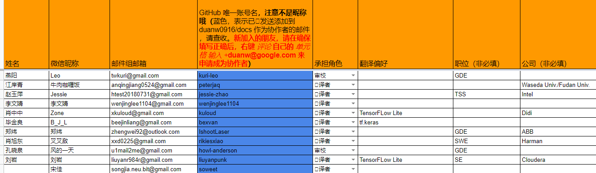
    如图中选中的部分，完成个人信息填写。其中，务必保证你的**邮箱**，**意向角色**和 **Github 账号**正确。

    *如果尚未拥有 Github 账号，请先[注册](https://github.com/)*

4. 正确填写文档内的个人信息后，等待 duanw0916 添加协作者的邮件(会发送到你注册 Github 的邮箱中)

    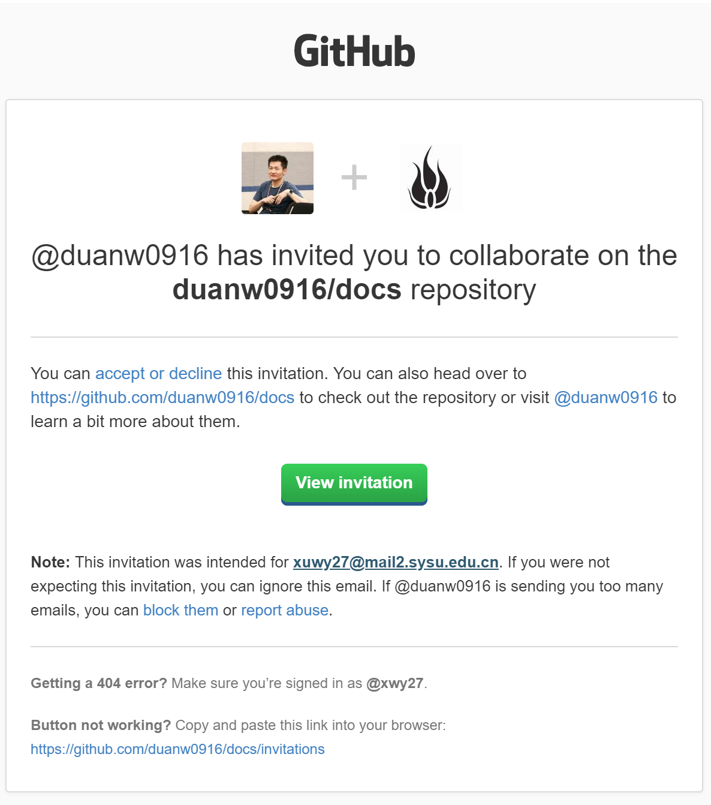
    
    收到邮件后，对邀请进行确认，则你已成为协作者。

    - 验证是否成为协作者

      打开 [Project](https://github.com/duanw0916/docs/projects/1)，如果你可以操作里面的 Card，那么你已经成为项目协作者。

5. 签署 [CLA](https://cla.developers.google.com/)，只需签署个人 CLA。签署完成之后，可看到如下信息：

    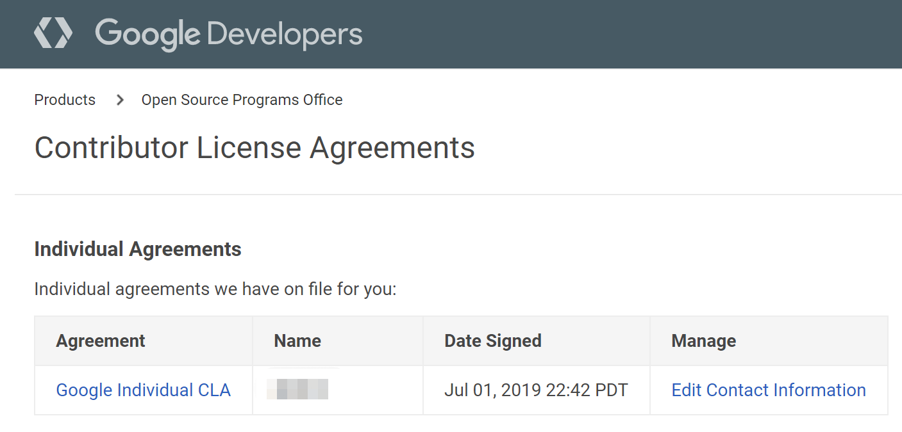

6. 加入微信工作群。项目成员间可通过微信群聊咨询相关问题。

    *目前微信群已达扫码加入上限，先添加负责人微信: BinaryHB，由负责人邀请加入。添加备注请注明 TensorFlow*

7. 请确保第4条中操作完成，正确成为协作者之后，在进行后续操作。

## 工具介绍

### 交流工具

- Google Group
- Google Hangouts
- Wechat

### 协作工具

- Github
- Github Project

## 操作手册

### 翻译

文档翻译首先需要将 TensorFlow 的[文档仓库](https://github.com/tensorflow/docs) fork 到个人 Github 账号下。
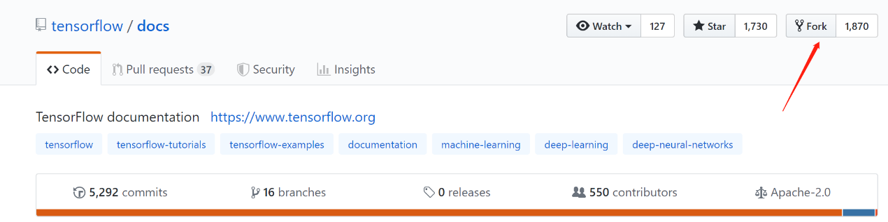
这个步骤完成后，将个人账号下的文档仓库下载到本地：
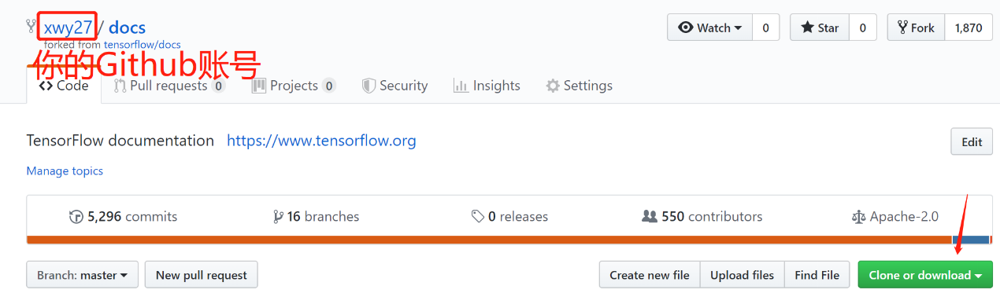

*注意定期和 TensorFlow 的文档仓库同步，避免后面发起 Pull Request 时有冲突。可参考[教程](https://blog.csdn.net/qianqianstd/article/details/80148341)。*

下面是每次进行文档翻译时的操作步骤:
1. 领取任务
    
    前往[Project](https://github.com/duanw0916/docs/projects/1)，领取任务(*需要在加入操作步骤中第 4 步成功成为协作者*)，按照下图进行任务领取：
    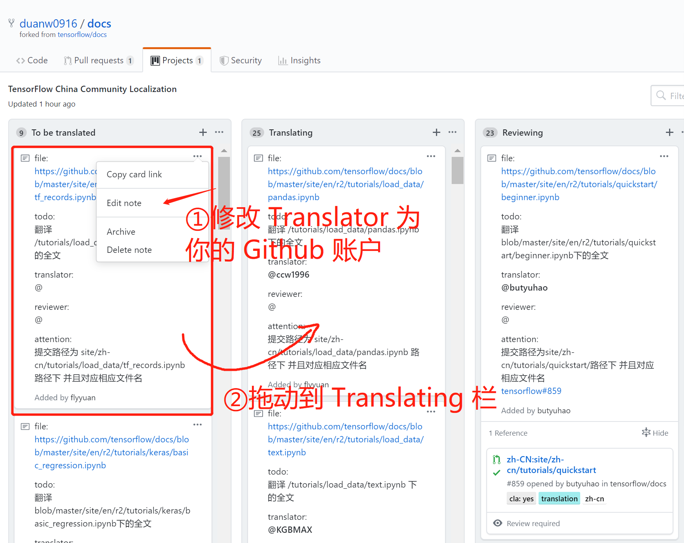

1. 翻译文档
    
    领取完任务后，按照上面任务中 attention 的提交路径创建文件，并且进行文档翻译。翻译时，请遵守 Google 文档编写的相关规范。

1. 推送到个人仓库
    
    翻译完毕后，将你的文档推送到你的Github个人仓库中。

1. 发起 Pull Request
    
    进入到你的Github个人仓库页面，点击 New pull request 和 Create pull request，发起 Pull Request。其中 Title 按照：zh-CN：xxxxx 格式填写。

    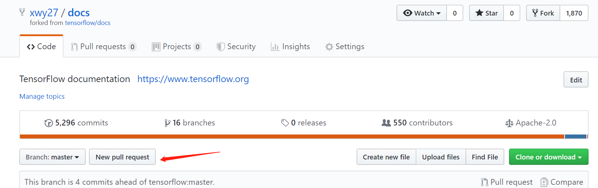
    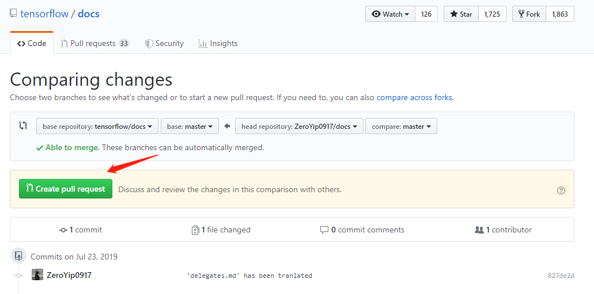
 
    成功发起 Pull Request 后，等待 Reviewer 进行审校。
    
    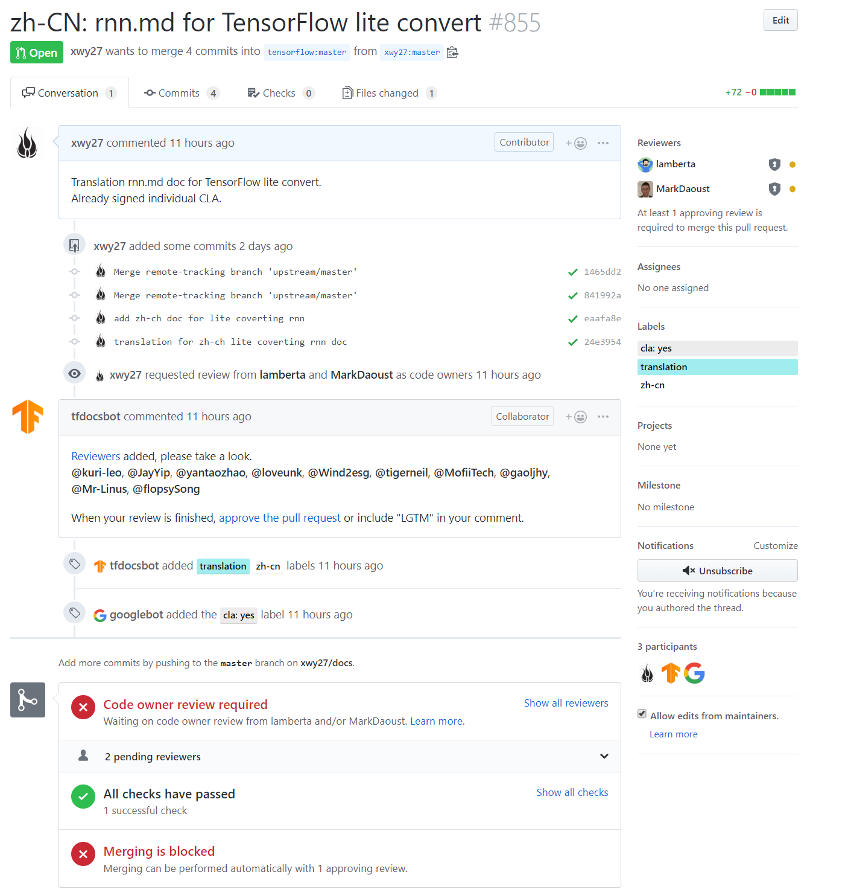

1. 等待审校意见和修改
    
    接下来，回到 [Project])https://github.com/duanw0916/docs/projects/1) 页面，找到你领取的任务，将板子拖动到 Reviewing 栏，等待 Reviewer 领取任务，对你的翻译进行审校。

    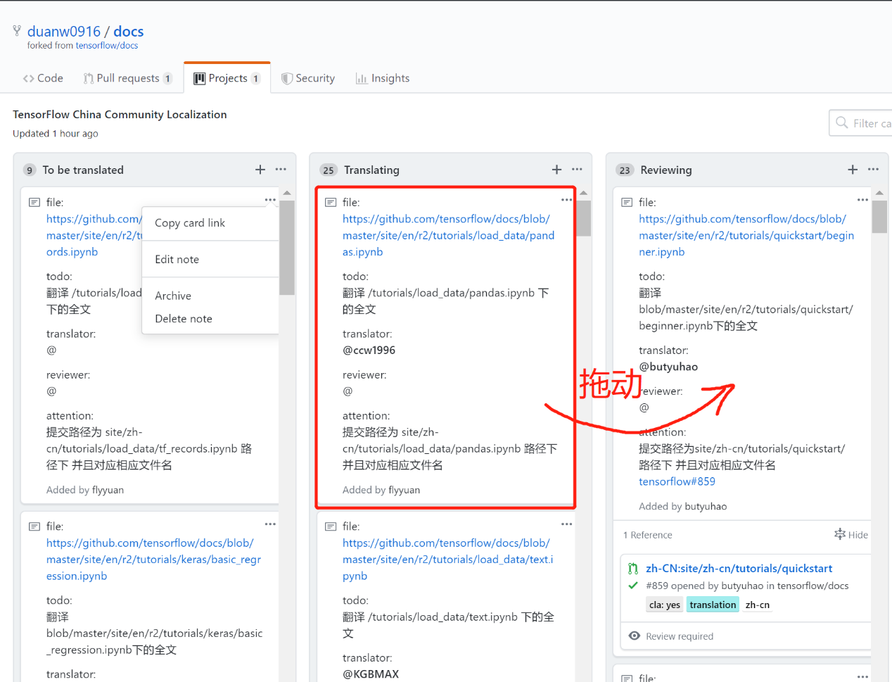

    之后，关注你发起的 Pull Request，Reviewer 会对你的翻译提出修改意见。根据修改意见，进行修改后，再次推送到你的Github 仓库(你的修改会实时反映到你的 Pull Request 中)。
1. 翻译结束
    
    当审校通过后，Reviewer 会给你的 Pull Request 打上 lgtm(look good to me) 的标签。这时，等待 TensorFlow 官方人员 merge 你的 pull request。当你收到如下消息时，这个翻译任务就完成了。

    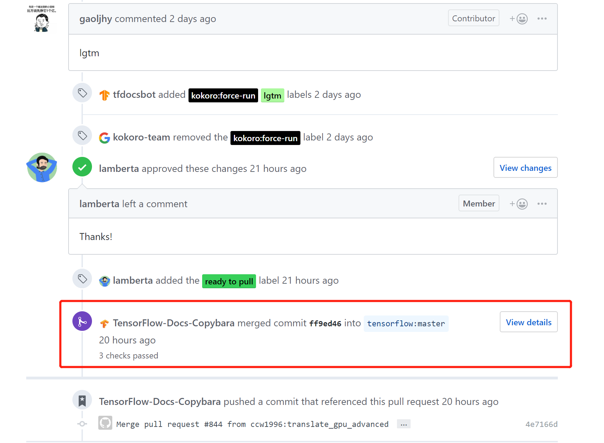

### 审校

### 协调

## FAQ

### 翻译

- Q: 有格式要求吗？
  > 有，请参看[指南](https://docs.google.com/document/d/1v7kwEhvtbbI4S4gulxLJDDN78gv0ZlDJ0cN92BUPrm0/edit)

- Q: 已翻译完了一篇文档，但是文档没有merge到主分支，可以认领新的翻译任务吗？
  > 每次提交 pull request 时，该分支下应该只对应一个翻译文件，因此，在一篇已翻译完的文档对应的 pull request 还没有 merge 到主分支而想认领新的翻译任务时，可以在自己 fork 的仓库下根据最新的 master 分支建立一个新的分支，在新的分支上进行新的翻译任务。具体方法参见[指南](https://www.tensorflow.org/community/contribute/docs)。

- Q: 如何处理 CLA 标签从 yes 变成 no 的情况？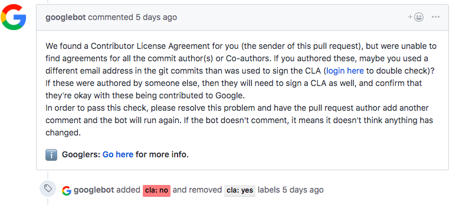
  > 如果您一直是用 ssh 校验提交，可能不会遇到此问题，但在一些情况下，例如将审校的建议直接在网页端提交后，可能会出现 cla:yes 变成 cla:no 的情况。此时最可能的原因就是 googlebot 的说明中提到的，提交的邮箱和签署 CLA 的邮箱不符。此时有两种解决方案：一是等待人工审核，如下图；二是如果您的 GitHub 个人设置的 Email 选项中并没有选中 Keep my email addresses private，即没有用 @users.noreply.github.com 作为您的网页端提交邮箱，则可以将您设置的 Primary email address 加入到您签署的 CLA 中，然后添加一条 “@googlebot rescan” 的评论，让 googlebot 重新检测 CLA 的签署情况。
  
  在[文档](https://opensource.google.com/docs/cla/#wrong-email)中给出了查看GitHub的某个 pull request 的提交人所用到的邮箱地址的方法，即在地址栏的地址后加上.patch，如https://github.com/grpc/grpc/pull/12.patch。

### 审校

### 协调

## 感言及展望
